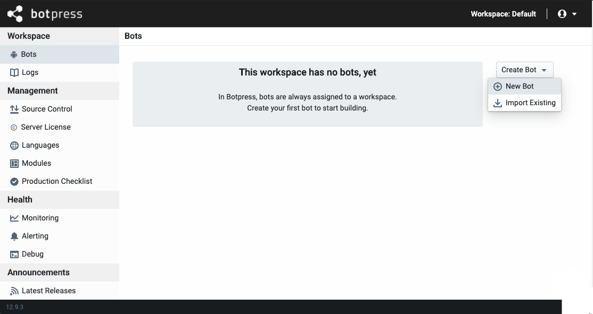
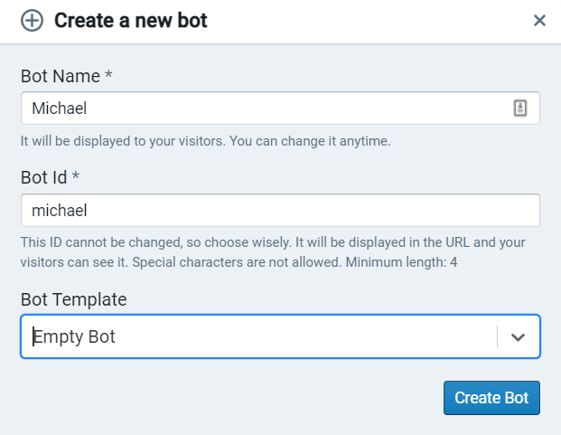
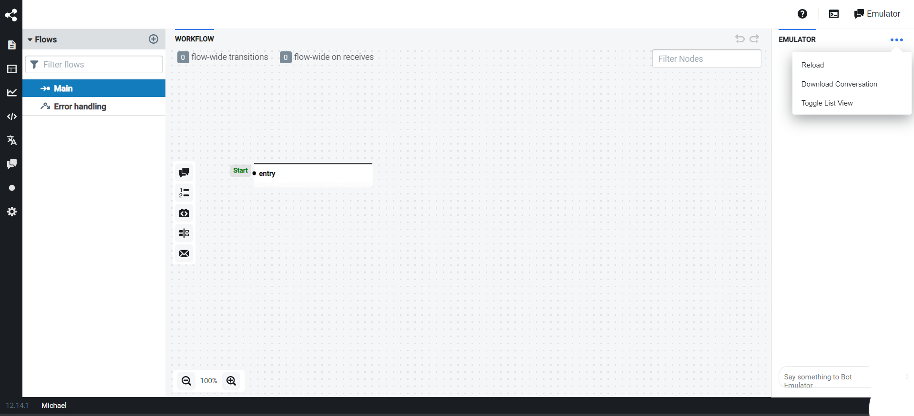
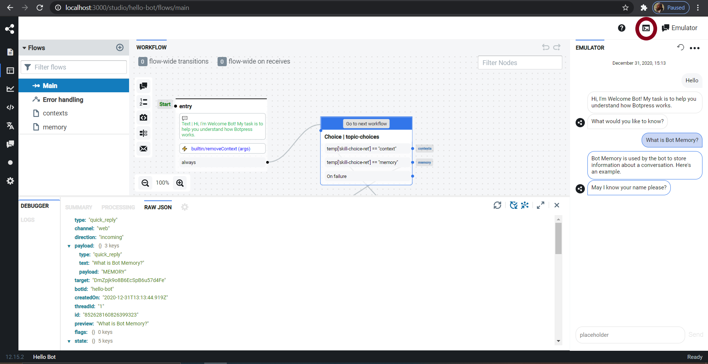

A Botpress Server installation has two main interfaces: the **Admin Dashboard** and the **Studio Dashboard**. Let's take a look at these two interfaces in detail.

## Admin Dashboard
The Admin Dashboard is where you manage and configure everything related to your Botpress Server installation. It is the one-stop-shop for all functionalities that affect all the chatbots on a Botpress Server instance.

### Features
The following features and configurations are done in the Admin Dashboard.

- Creating new chatbots
- Managing your Botpress Pro license and sync with version control
- Updating your profile and your Botpress Account [^1]
- Unpacking and activating modules
[^1]: Please bear in mind that this account only exists on your local Botpress installation. There is no central authentication service linked to our servers.

To open the Admin Dashboard, visit [`http://localhost:3000`](http://localhost:3000) in your favorite web browser. After that, register the main admin account to start using Botpress.

### Creating a new chatbot
In Botpress, each different chatbot belongs to a workspace. When you start Botpress for the first time, you'll have a default workspace created automatically for you.

Let's create a new chatbot with the **Create bot> New Bot** button.

All you have to do is pick a name for your chatbot (a unique `Bot ID` will be generated for you), then select a chatbot template.

> The **Bot ID** can't be changed in the future, so it's crucial to pick a meaningful name. Also, bear in mind that this ID will be visible to the users of your chatbot.

You may start from scratch with the "Empty Bot," or you can use one of the available templates for a quick demonstration of various features.

Once created, click on the chatbot's name to open the Studio interface and edit your chatbot.

## Studio Dashboard

The studio is the main interface you'll use to build and edit your chatbot. From here, among other things, you can:

- Train an NLU model
- Create dialog workflows
- Manage content
- Test and debug your chatbot

You will notice on the left menu there are a couple of sections available. Some of these are built inside Botpress (like _Content_ and _Flows_), while others are there because of modules installed. 

Indeed, Botpress is a highly modular platform, and the modules themselves provide the majority of the features you will use. You may use experimental ones or even develop your modules.

### Test your chatbot
There is a chat emulator built in the studio with which you can test your chatbot. You can open it from the <kbd>Emulator</kbd>button in the top right corner or press 'E' while in the studio.

The chat emulator represents what your visitors will face when they speak with your chatbot. You can reset the conversation by clicking the reset button. Or you can also start a new conversation with your chatbot with the conversations button.

*In the order presented: Debug, Reset, Download, Conversations, Close emulator.*

Open the chat window and say, "_Hello_." If you selected the **Welcome Bot** template, it should greet you with something like "_Hi, I'm Welcome Bot! My task is to help you understand how Botpress works._".

You can get additional information from the emulator's debugger by selecting the debug button. This panel is specifically designed for you, as the chatbot developer, to understand why you get a specific answer. Note that it is only available for authenticated users. It includes all sorts of useful information: the dialog engine's elected suggestion, nodes flowed through, and natural language intents or questions. You can also view the raw JSON event that contains all details if you need further data.

### Question and Answer

One of the modules shipped by default with Botpress is the Q&A (Question and Answer) module. This module allows you to easily and quickly add knowledge to your chatbot without creating a flow or writing code. Q&A uses the NLU engine to detect the questions and automatically answer them.

#### Adding a Q&A

1. Click the **Q&A** panel on the left.
2. Click the "**Add New**" button.
3. Type in the "Questions" textbox any question, for example: "How old are you?". Then add as many different ways of asking the same question as you want.
4. In the "Answers" section, type the message you want your chatbot to provide, then press Enter to commit the answer.
5. Click "**Add**."

The Q&A module will automatically retrain the NLU model in the background and tell you when it's completed, indicated in the bottom right. You can speak again with your chatbot, and it should respond to your question correctly, even if you make some typos!

#### Q&A Example

## Share your chatbot

### Standalone chat

Congratulations on building your first chatbot! You can share this chatbot with your friends, provided they have access to your computer. It is available at `http://localhost:3000/s/<<Bot ID>>`.

### Website embedding

You can also embed this chatbot on a website. To learn how, check out the example provided in `assets/modules/channel-web/examples/embedded-webchat.html`, which you can see by browsing [**here**](http://localhost:3000/assets/modules/channel-web/examples/embedded-webchat.html).

- [Hello < you>!, our equivalent of Hello World!](https://youtu.be/nYFX-P1zFEE)
